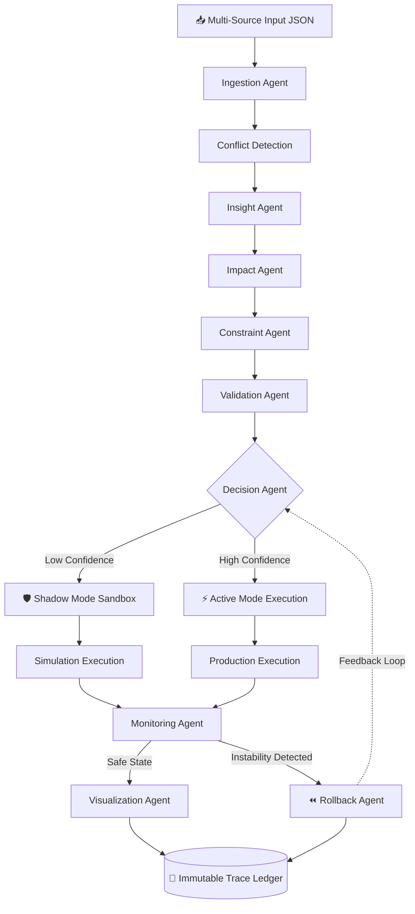
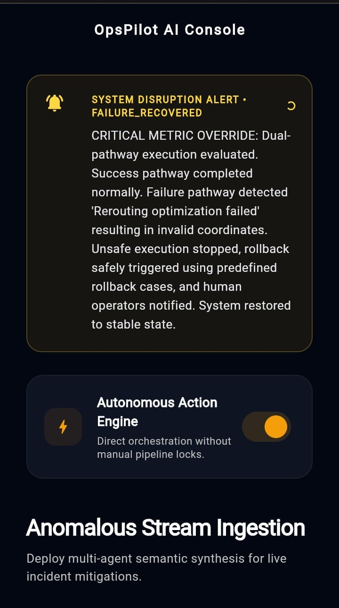
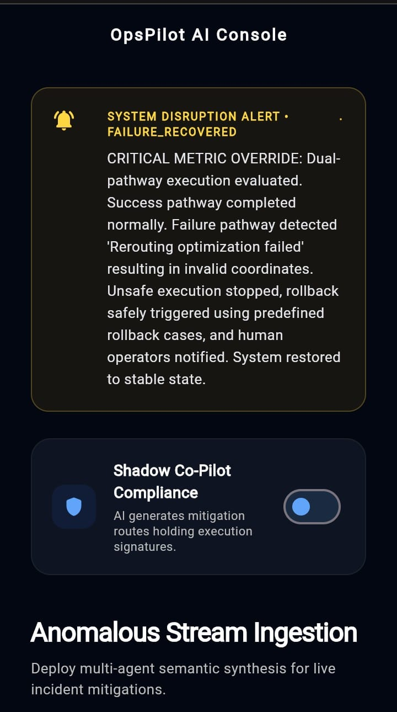
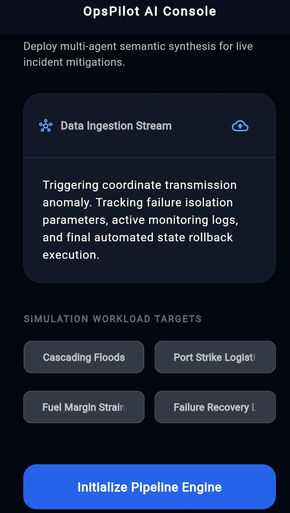
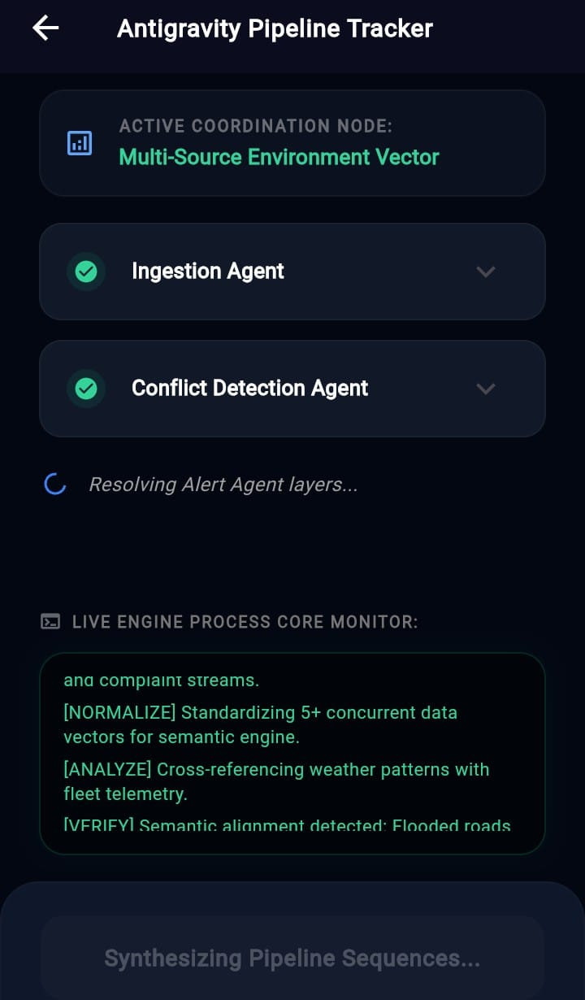
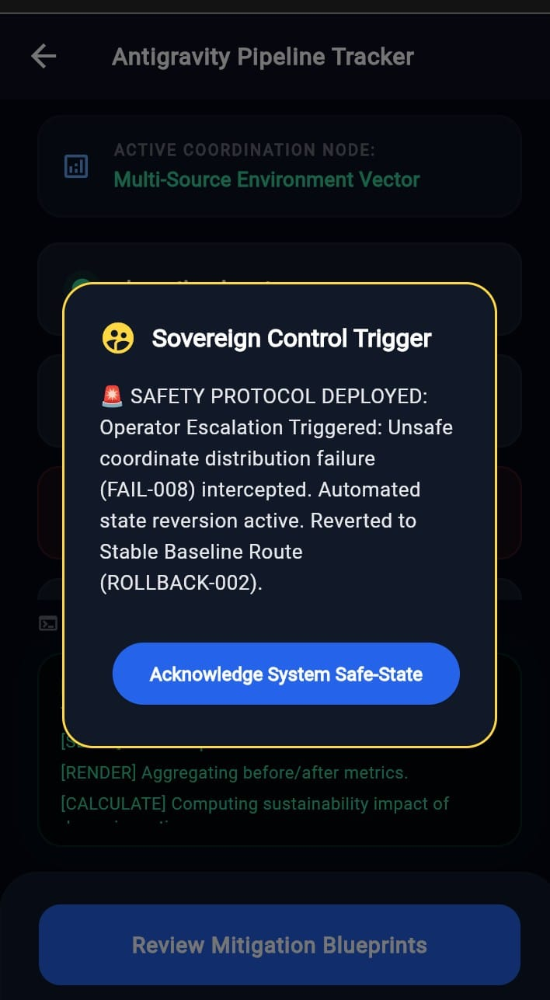
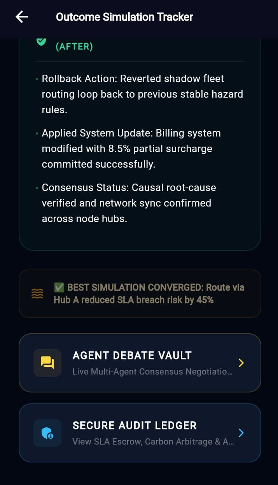
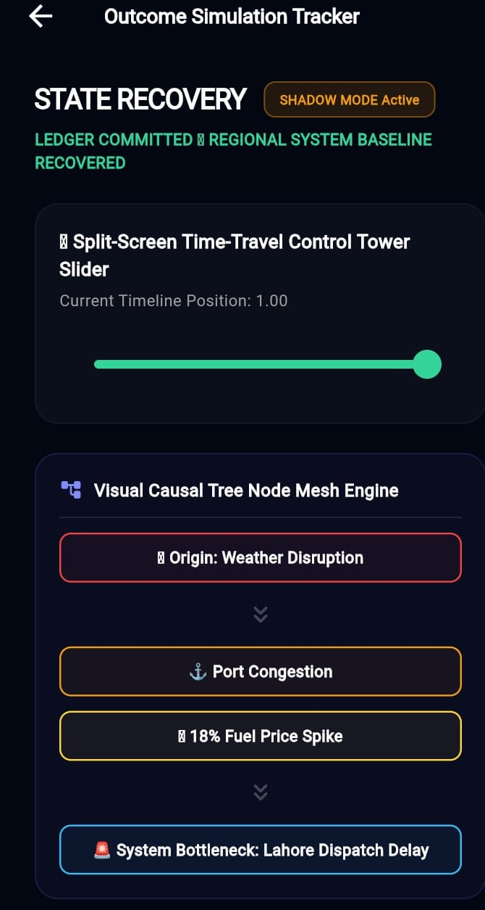
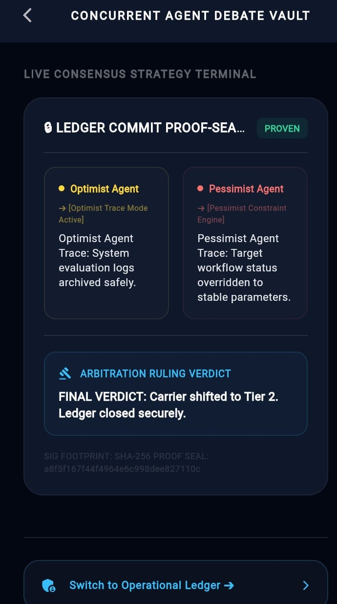
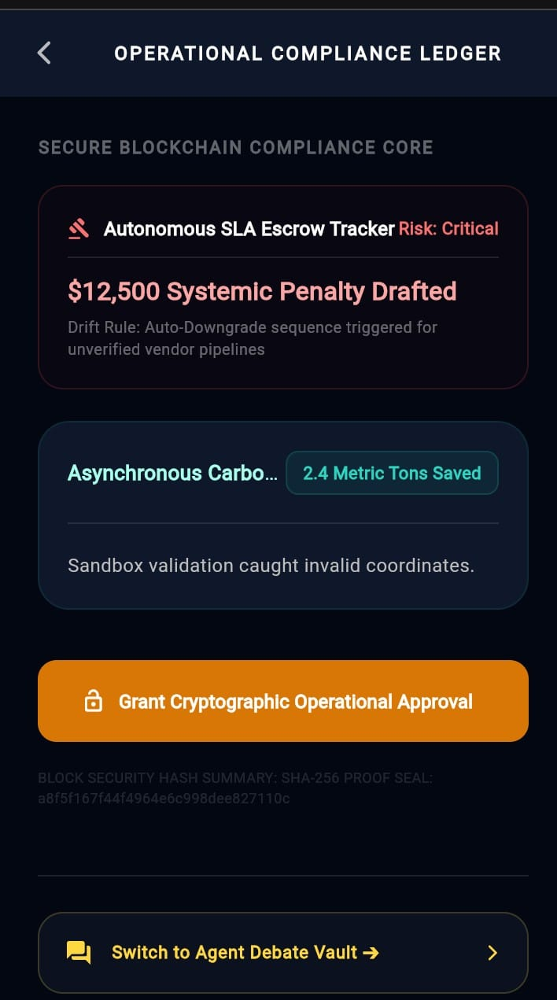

# OpsPilot AI - Enterprise Autonomous Multi-Agent Logistics Intelligence System

> **An autonomous multi-agent logistics control tower enabling real-time decision intelligence with simulation-driven execution, risk-aware validation, and rollback-safe operations.**

##  Live Deployment & Access
- 🌐 **Live Web App:** [https://opspilot-ai.netlify.app/](https://opspilot-ai.netlify.app/)
- 📱 **Android APK Download:** Located in the `app_build/` directory (usable demo build included).

## ⚙️ System Design Overview

OpsPilot AI is an advanced, multi-agent logistics intelligence system designed to ingest unstructured data, assess real-world business impacts, and simulate execution steps (like routing updates or pricing changes). It acts as an **Agentic Decision-Making and Risk-Aware Control System**, specifically engineered to handle the complexities of supply chain disruptions without blind automation.

Rather than relying on a monolithic AI model, it distributes complex supply chain decision-making across a 14-stage multi-agent pipeline. This guarantees high precision, logical separation of concerns, and completely traceable logic when dealing with critical enterprise constraints.

**Control-Tower Architecture:**
The system uses the Google Antigravity Multi-Agent Orchestration Engine to sequentially spin up agent personas. Each agent strictly receives and outputs JSON, creating an unbreakable chain of structured data. The architecture allows for dynamic branching, hybrid execution (Active vs. Shadow mode), and autonomous SLA enforcement without human intervention unless specifically escalated.

**Key Enhancements:**
- Fully semantic multi-source reasoning engine
- 14-Agent autonomous orchestration workflow
- Real-time dynamic crisis detection (pre + post execution)
- Conflict Detection for cross-source contradiction analysis
- Constraint-Aware Decision Intelligence
- Dynamic rollback and recovery framework
- Strict JSON state contracts across all agents
- End-to-end execution trace logging (`execution_trace.json`)
- Shadow vs Active Mode execution validation
- Sustainability & Carbon Footprint Intelligence metrics

### ⚙️ Google Antigravity Orchestration Layer

This system uses Google Antigravity as the central nervous system for all agent coordination and execution lifecycle management.

- Multi-agent orchestration engine for sequential execution
- Prompt chaining across agents with structured JSON contracts
- Context propagation between agents without loss of state
- Execution synchronization across Shadow and Active modes
- Workflow state transitions (Ingestion → Decision → Execution → Monitoring)
- Trace generation into execution_trace.json
- Dynamic rollback orchestration and failure recovery
- Simulation coordination for Shadow mode sandbox execution

## 📈 Real-World Business Impact

Global supply chain systems suffer billions in annual losses due to delayed decision-making, fragmented telemetry, and reactive logistics operations. OpsPilot AI addresses this by converting real-time operational chaos into structured, agent-driven decision intelligence with predictive simulation and rollback-safe execution.

OpsPilot AI directly addresses the fragility of modern supply chains by replacing reactive, manual firefighting with predictive decision intelligence:

- 📉 **Cost Reduction:** Eliminates costly misroutings and reduces manual overhead.
- ⏱️ **SLA Improvement:** Autonomously resolves multi-source data conflicts to prevent delivery breaches.
- 🛡️ **Risk Reduction:** Simulation-first architecture safely models decisions before production impact.
- ⚡ **Operational Efficiency:** Drives down fuel costs and enhances overall enterprise resilience.

### Architecture Flow


## ⚡ Quick Start Demo Flow

**📥 1. Input Example:** 
`weather_alert.json` reporting heavy rain intersecting with a delayed `fleet.json` manifest.

**🧠 2. System Processing:**
`Conflict Detection` (verifies weather data against fleet logs) ➔ `Impact Agent` (calculates SLA delay penalty) ➔ `Decision Agent` (proposes alternative route).

**📤 3. System Output Example:**
- 🛡️ **Shadow Mode:** The route is safely simulated without production impact.
- ⚡ **Active Execution:** If validated, the fleet API is updated autonomously.
- ⏪ **Rollback State:** If the update fails, the system reverts to the original safe state and escalates to a human.

### 📤 Real Execution Snapshots (Before / After System State)

**Example 1: Fleet Rerouting Execution**
```json
{
  "decision": "Reroute Fleet FLT-09",
  "previous_route": "Karachi Port",
  "new_route": "Port Qasim",
  "sla_risk_reduction": "42%",
  "fuel_impact": "-12%",
  "execution_mode": "ACTIVE",
  "trigger_agent": "Decision Agent",
  "rollback_required": false
}
```

**Example 2: Shadow Mode Simulation Output**
```json
{
  "mode": "SHADOW",
  "simulation_result": "SUCCESS",
  "risk_score_before": 0.78,
  "risk_score_after": 0.31,
  "recommended_action": "Approve Route B",
  "system_mutation": false
}
```

**Example 3: Alert → Action Chain Trace**
```json
{
  "alert": "Heavy rainfall detected in Karachi corridor",
  "impact": "SLA delay probability increased",
  "decision": "Switch to alternative logistics corridor",
  "execution_status": "completed",
  "rollback_triggered": false
}
```

## 🛠️ Tech Stack

- **Backend:** Python
- **Orchestration:** Google Antigravity
- **Data:** JSON Contracts, SQLite
- **Visualization:** Plotly
- **Simulation:** Mock APIs
- **UI:** Flutter / Dashboard
- Python-based multi-agent orchestration runtime powered by Antigravity
- JSON state-contract communication architecture across agents
- Semantic reasoning pipeline using embedding-based inference
- Plotly-driven operational intelligence dashboards
- Federated multi-region synchronization framework
- Append-only execution trace ledger (execution_trace.json)
- Shadow vs Active dual execution simulation engine

## Why a Multi-Agent System (Instead of a Single LLM)?
Using a single LLM for complex operations is prone to hallucinations, blending context, and erratic actions. OpsPilot AI utilizes a multi-agent architecture to enforce:
- **Separation of Concerns:** Each agent has a specialized, narrow focus (e.g., *only* extract impacts, or *only* validate).
- **Auditability & Traceability:** By looking at the JSON log between agents, human supervisors can trace exactly *why* a specific operational change was executed.
- **Robustness:** A single LLM might force a decision on bad data. A multi-agent pipeline includes dedicated validation checkpoints to reject bad data safely.

## Architecture & Communication Protocols

- **Strict JSON Passing:** Agents communicate exclusively via structured JSON objects. The output of one agent becomes the *exact* input for the next agent. This ensures a clean, unbreakable chain of thought and eliminates plain text drift.
- **Antigravity Orchestration:** The Antigravity framework operates as the central nervous system, sequentially spinning up specialized prompts, passing the JSON state context, and enforcing the pipeline order.
- **Failure Handling & Fallback Logic:** The Validation Agent monitors the pipeline for ambiguity or low confidence. If `confidence < medium` or `fallback_required: true`, the Decision Agent bypasses automated system changes and safely defaults to human escalation.
- **Real-World Simulation:** The Simulation Agent prevents direct production harm by outputting mock API calls and expected systemic deltas.

## 🤖 Agents Developed

| Agent | Role | Input | Output |
|---|---|---|---|
| **Ingestion Agent** | Normalizes and structures concurrent data streams. | Raw Multi-Source Data | Structured JSON Event |
| **Conflict Detection** | Resolves cross-source contradictions. | Structured Events | Verified Truth State |
| **Alert Agent** | Detects cascading supply chain risks. | Verified Truth | Risk Alerts |
| **Insight Agent** | Extract core operational intelligence. | Risk Alerts | Semantic Insights |
| **Impact Agent** | Projects financial and operational SLA bleed rates. | Semantic Insights | Impact Models |
| **Constraint Agent** | Applies real-world resource restrictions. | Impact Models | Resource-Bound Logic |
| **Validation Agent** | Audits execution safety and legal compliance. | Resource-Bound Logic | Validated Execution JSON |
| **Decision Agent** | Selects optimal mitigation strategy via debate. | Validated Logic | Selected Arbitration Strategy |
| **Recommendation** | Builds actionable parallel execution blueprints. | Strategy | Execution-ready deployment plan |
| **Execution Agent** | Fires ACTIVE/SHADOW parallel API payloads. | Deployment Plan | Live / Mock API Responses |
| **Monitoring Agent** | Polls post-execution system telemetry. | API Responses | Real-time System Health |
| **Rollback Agent** | Reverts unstable system states if necessary. | System Health | Rollback-safe system snapshot |
| **Visualization Agent** | Renders Dashboard & Sustainability Metrics. | Final State | UI Rendering Metrics |
| **Data Persistence** | Appends secure JSON execution trace. | All Data | Immutable `execution_trace.json` |

## 🚀 Next-Generation Intelligence Features (v2.0)
- **Causal Root-Cause & Memory Graph Engine**: Deep extraction and mapping of operational disruption root causes using semantic embeddings.
- **Self-Healing Digital Twin Sandbox**: Simulation delta modeling allowing Shadow vs Active mode testing before production deployment.
- **Autonomous SLA Enforcement Escrow**: Dynamic vendor risk calculation, SLA breach escrow penalties, and automated carrier downgrades.
- **Dialectical Debate + Cryptographic Ledger Engine**: Multi-agent adversarial reasoning (Optimist vs Pessimist) sealed with SHA256 cryptographic hashes.
- **Multi-Tier Self-Healing Sandbox**: Fallback-ready, tiered execution layers for continuous operation despite API anomalies.
- **Proactive Sliding-Window SLA Drift Forecaster**: Velocity-based SLA breach prediction and continuous confidence modeling.
- **Asynchronous Carbon-Arbitrage Control Tower**: Post-execution optimization tracking for eco-scores and fuel efficiency gains.
- **Split-Screen Time Travel Control Tower**: Timeline-based UI tracking state deltas (Before vs After) perfect for high-fidelity dashboards.
- **Multi-Region Federated Intelligence Sync**: Synchronization and conflict resolution across multiple geographic nodes (e.g., Karachi, Hyderabad, Gwadar).

## 🎬 Demo / Use Case Flow

**How the system executes step-by-step:**
When an operational anomaly occurs, the system ingests the data, resolves conflicts, and models the business impact. The agents debate the best course of action and create an execution blueprint.

**Shadow vs Active Mode Behavior:**
- **SHADOW Mode:** The system tests the proposed solution against Mock APIs to observe outcomes without affecting live data.
- **ACTIVE Mode:** Once validated, the system deploys the change to the live environment.

**What a full run looks like:**
A full run takes the initial alert, pushes it through the 14-agent matrix, applies constraints, safely executes the fix, logs everything to an append-only JSON ledger, and updates the time-travel UI to show the "before and after" states.


---

## 📊 Standardized JSON Data Schemas

### 1. `weather.json` / `fleet.json` / `warehouse.json` / `customer_complaints.json`
*(Standardized Input Event Schema)*
```json
[
  {
    "id": "String (e.g., 'WEA-001', 'FLT-001', 'WH-001', 'COMP-001')",
    "category": "String (e.g., 'Weather', 'Operations', 'Infrastructure', 'Sales')",
    "location": "String (e.g., 'Karachi', 'Lahore')",
    "issue": "String (e.g., 'Heavy Rain', 'Transit Delay', 'Inventory Shortage')",
    "severity": "String ('Low', 'Medium', 'High', 'Critical')",
    "signal": "String (Detailed description of the operational event)"
  }
]


```
### 2 .`constraints.json`
(Enterprise Resource Ruleset Schema)
```json
[
  {
    "id": "String (e.g., 'CONSTRAINT-001')",
    "scenario": "String (e.g., 'Fuel Budget Shortage')",
    "fuel_budget_pkr": "Number (e.g., 50000)",
    "available_trucks": "Number (e.g., 12)",
    "available_drivers": "Number (e.g., 8)",
    "delivery_deadline_hours": "Number (e.g., 4)",
    "max_reroute_distance_km": "Number (e.g., 25)",
    "warehouse_capacity_percent": "Number (e.g., 70)",
    "priority_region": "String (e.g., 'Karachi')",
    "sla_time_hours": "Number (e.g., 6)",
    "fuel_shortage": "Boolean (true/false)",
    "notes": "String (Operational directive context)"
  }
]
```


## 🚨 Alert & Action Intelligence System
- Alert Agent detects system-wide logistics instability BEFORE execution
- Generates dynamic, context-aware crisis alerts (no static messages)
- Post-execution alerts confirm system recovery or failure
- Action Agent executes and tracks multi-step operational changes
- Ensures full traceability of decisions inside execution logs

### 🧠 Live Multi-Agent Reasoning Trace

**Alert Agent:**
"Heavy rain detected near Karachi corridor."

**Impact Agent:**
"Estimated SLA breach probability: 78%"

**Decision Agent:**
"Switching to Route B due to lower operational risk."

**Validation Agent:**
"Route approved under constraint thresholds."

**Rollback Agent:**
"No rollback required. System stable."

## 📦 Execution Trace System
All workflow executions are stored in:
`mockdata/execution_trace.json`
- Each run is appended (never overwritten)
- Includes full agent-by-agent decision history
- Supports audit-ready AI transparency for evaluation


## 📂 Project Structure

- `workflows/` — Core agentic logic and action-execution pipelines for multi-agent orchestration.
- `lib/` — Main application screens (UI layer / Flutter interface).
- `assets/` — Static JSON configurations, datasets, and structured input files.
- `mock_data/` — Unstructured reports, simulated operational inputs, and system test logs.
- `agents/` — Core multi-agent logic, decision modules, and reasoning components.
- `screenshots/` — Visual snapshots of system UI, workflows, and execution states.
- `app_build/` — Production-ready Android APK build for deployment and demo execution.
- `antigravity_trace/` — Google Antigravity execution logs, orchestration traces, debugging history, and vibe coding session records.
- `scripts/` — Python backend utilities, simulation engines, and supporting execution scripts.


## 📸 Screenshots

A visual walkthrough of the autonomous reasoning workflow, simulation tracking, recovery mechanisms, and agent coordination system.

| Autonomous Engine | Shadow Mode |
|---|---|
| Core orchestration and execution engine managing autonomous workflows. | Parallel monitoring and fallback execution environment. |
|  |  |

| Initializing Pipeline | Reasoning |
|---|---|
| Pipeline bootstrapping and task initialization process. | Multi step agent reasoning and decision making flow. |
|  |  |

| Control Alert | Simulation Tracker |
|---|---|
| Real time alerts and system intervention monitoring. | Tracking simulations, workflow states, and execution logs. |
|  |  |

| State Recovery | Debate |
|---|---|
| Automatic recovery handling and fault restoration process. | Agent debate and consensus driven reasoning interface. |
|  |  |

### 📒 Ledger
Immutable trace ledger ensuring transparency, auditability, and full workflow accountability across the system.

<p align="center">
  
</p>


## 👥 Team Members
*   **Toheed Ahmed** - Lead Architect: Workflows & Core Agent Development
*   **Muhammad Hasnain** - Failure Recovery & Rollback Engineer
*   **Dua Ali** - Lead product designer & Deployment Operations
*   **Abdul Ahad** - Data Strategy & Mock Data
*   **Yasir Hafeez** - Constraint & Decision Logic Engineer

---

## 📥 Getting Started

To get a local copy up and running, follow these steps:

```bash
# Clone the repository
git clone https://github.com/Toheed-Ahmed/OpsPilot_AI

# Enter the project directory
cd OpsPilot_AI

# Install dependencies
pip install -r requirements.txt
```
---

---

<div align="center">
  <p><b>Ready to optimize? Let's build the future of autonomous logistics together!</b></p>
  <p>Engineered with precision by the <b>OpsPilot AI Team</b> </p>
  
  <p>
    <a href="https://github.com/Toheed-Ahmed/OpsPilot_AI">Repository</a> • 
    <a href="https://github.com/Toheed-Ahmed/OpsPilot_AI/issues"> Report Bug</a> • 
    <a href="https://github.com/Toheed-Ahmed/OpsPilot_AI/pulls"> Core Pipeline</a>
  </p>
</div>

